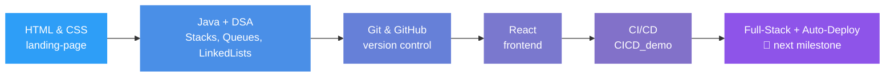

<p align="center">
  
</p>

<p align="center">
  <a href="https://git.io/typing-svg">
    
  </a>
</p>

<p align="center">
  
  
</p>

<p align="center">
  
  
</p>

<p align="center">
  <a href="#-about-me">About</a> ·
  <a href="#-pinned-projects">Projects</a> ·
  <a href="#%EF%B8%8F-tech-stack">Tech Stack</a> ·
  <a href="#-github-stats">Stats</a> ·
  <a href="#-contribution-snake">Snake</a> ·
  <a href="#-connect-with-me">Connect</a>
</p>

<p align="center">
  
</p>

---

### 🚀 About Me

I'm a developer based in Pakistan who likes building things end-to-end — from the HTML/CSS on a landing page to the pipeline that ships it. Most of what's in this profile started as a "let me figure out how this works" project.

- 🔭 Right now I'm deep in **CI/CD pipelines** — getting comfortable with GitHub Actions beyond the basics
- 🌱 Working through **DSA** properly (stacks, queues, linked lists first, trees/graphs next)
- 💻 Day-to-day stack: **HTML, CSS, JavaScript, React, Java, Git**
- 🎯 Next milestone: ship a small full-stack app with its own automated deploy pipeline
- 📫 Reach me at: **arain.hassan54@gmail.com**

<br>

<table align="center">
<tr>
<td valign="top" width="50%">

**📌 Currently Learning**

| Topic | Status |
|---|---|
| Data Structures & Algorithms | 🟢 In Progress |
| CI/CD Pipelines (GitHub Actions) | 🟢 In Progress |
| React | 🟢 In Progress |
| Advanced JavaScript | 🟡 Started |
| Cloud Fundamentals | 🔵 Up Next |

</td>
<td valign="top" width="50%">

**🎯 2026 Goals**

- ✅ Build & deploy a full CI/CD pipeline
- ✅ Solve 100+ DSA problems
- ⬜ Contribute to an open-source project
- ⬜ Build a full-stack production app

</td>
</tr>
</table>

<p align="center">
  
</p>

### 🗺️ My Learning Journey



---

### 📌 Pinned Projects

<p align="center">
  <a href="https://github.com/HassanNasir2004/landing-page">
    
  </a>
  <a href="https://github.com/HassanNasir2004/DSA-Task">
    
  </a>
</p>
<p align="center">
  <a href="https://github.com/HassanNasir2004/CICD_demo">
    
  </a>
  <a href="https://github.com/HassanNasir2004/HassanNasir-CICD-Project">
    
  </a>
</p>

> 💡 Tip: You can also pin these officially via **your GitHub profile → Customize your pins** so they show up twice — once natively, once styled here.

<br>

<table align="center">
<tr>
<td valign="top" width="100%">

**🔦 Featured: [CICD_demo](https://github.com/HassanNasir2004/CICD_demo)**

A hands-on project for learning how to automate the build → test → deploy cycle with GitHub Actions instead of doing it manually. This is where most of the "CI/CD Enthusiast" in my tagline comes from.

</td>
</tr>
</table>

---

### 🛠️ Tech Stack

<p align="center">
  
</p>

<details>
<summary align="center"><b>📊 Skill Proficiency (click to expand)</b></summary>
<br>

```text
HTML/CSS        ████████████████████░░░░  80%
JavaScript      ███████████████░░░░░░░░░  60%
React           █████████████░░░░░░░░░░░  50%
Java            ██████████████░░░░░░░░░░  55%
Git & GitHub    █████████████████░░░░░░░  70%
CI/CD           ████████████░░░░░░░░░░░░  50%
DSA             ███████████░░░░░░░░░░░░░  45%
```

</details>

---

### 📊 GitHub Stats

<p align="center">
  
  
</p>
<p align="center">
  
  
</p>

<p align="center">
  
  
</p>

---

### 🏆 GitHub Trophies

<p align="center">
  
  
</p>

---

### 📈 Contribution Graph

<p align="center">
  
  
</p>

---

### 🐍 Contribution Snake

<p align="center">
  
  
</p>

> ⚙️ Requires a one-time setup — see `snake.yml` workflow below (also shared with this README).

---

### ⏱️ Weekly Coding Activity

<!--START_SECTION:waka-->
```text
Connect WakaTime (see note below) to show real weekly coding hours here.
```
<!--END_SECTION:waka-->

> 💡 Optional: link a free [WakaTime](https://wakatime.com/) account + the `waka-readme` GitHub Action to auto-fill this box with your real weekly language breakdown.

---

### 😄 Random Dev Joke

<p align="center">
  
</p>

---

### ☕ Support Me

<p align="center">
  <a href="https://www.buymeacoffee.com/hassannasir" target="_blank">
    
  </a>
</p>

---

### 🤝 Connect with Me

<p align="center">
  <a href="https://www.linkedin.com/in/hassan-nasir-2403a7297/" target="_blank">
    
  </a>
  <a href="mailto:arain.hassan54@gmail.com">
    
  </a>
</p>

<p align="center">
  
</p>
